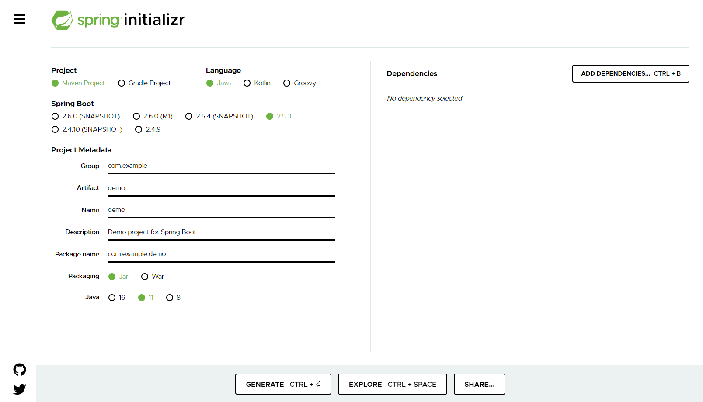

## Day 1
I'm learning Java with the aim of creating an MVC structured API.

Starting off, I have been looking at installation and comparing the overall environment with javascript Node development.

### Basic Java Setup
The main parts involved in setting up Java MVC project on Windows include :
- Java installation
- JDKs
- Maven
- Spring.io
- Intellij Idea (optional alternative to VS Code)

#### Java Installation
Versions 8 and 11 appear to be the LTS version still in use by the community. I initially installed 8 (x64) but later installed 11 (x64). Running 'java \-\-version' returned the following:
- openjdk 11.0.11 2021-04-20
- OpenJDK Runtime Environment AdoptOpenJDK-11.0.11+9 (build 11.0.11+9)
- OpenJDK 64-Bit Server VM AdoptOpenJDK-11.0.11+9 (build 11.0.11+9, mixed mode) 

The JRE (Java Runtime Environment) is the compiler used by the JDK and Maven. 

I'm not sure how this is set or changed to point to a different Jave version. I think it changes inherently when using a different JDK.

#### JDKs (Java Development Kits)
 After some experimentation I currently have the following (excessive number of JDKs) installed and added to the 'path' variable:
  - C:Program Files\AdoptOpenJDK\jdk-11.0.11.9-hotspot\bin
  - C:Program Files\Amazon Corretto\jdk11.0.12_7\bin
  - C:Program Files\AdoptOpenJDK\jdk-8.0.292.10-hotspot\bin
  - C:Users\\..\redhatjdk\java-1.8.0-openjdk-1.8.0.302-1.b08.dev.redhat.windows.x86_64\bin
  - C:Program Files\Java\jdk-16.0.2

The active JDK looks like it is set with the JAVA\_HOME variable which is currently set to:
- C:Program Files\AdoptOpenJDK\jdk-11.0.11.9-hotspot\bin

#### Maven
Maven is a software project management tool. Similar to the 'npm' command in javascript, 'mvn' or 'mvnw' CLI is used to launch an application. 

It does seem to handle package (library) management but I'm not sure how other than via the Spring.io project generator.

The CLI is accessed globally after setting the path variable:
- C:\Users\\..\apache-maven-3.8.1\bin 

#### Spring.io
Spring provides the project templates. Its fairly easy to get started with.

Once JDKs are installed, navigating to https://start.spring.io, you can generate a new project:

### Deployment Options
In order to demonstrate the site I'm hoping to host it. Ideally I'd like to set up some form of deployment with an initial template before starting development. 

This gets tricky when each deployment option is expecting different JDKs or setups. 

Ideally Docker could be used to avoid this but setting up Docker on a Linux container could become a rabbit hole in itself. 

So far I have looked at:
 - Heroku - <a href="https://devcenter.heroku.com/articles/deploying-java" target="blank">https://devcenter.heroku.com/articles/deploying-java</a>
 - AWS EB with Corretto JDK - <a href="https://docs.aws.amazon.com/corretto/" target="blank">https://docs.aws.amazon.com/corretto/</a>
 - Docker (Docker host TBA) - <a href="https://docs.docker.com/get-started/" target="blank">https://docs.docker.com/get-started/</a>