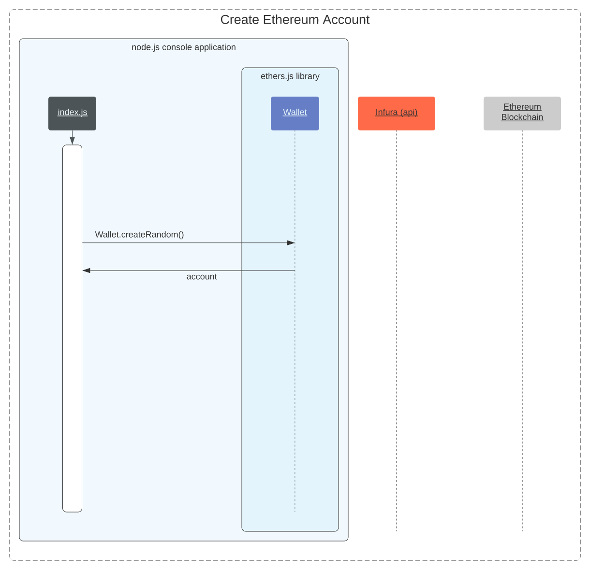
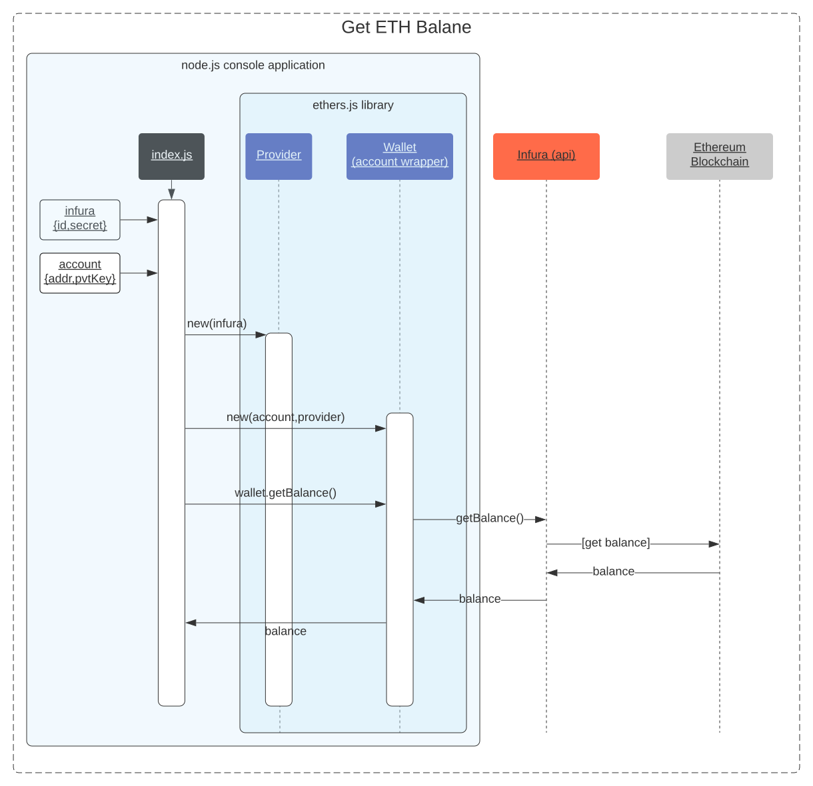
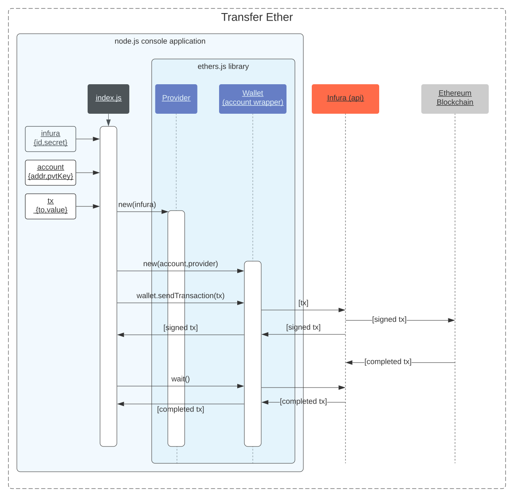
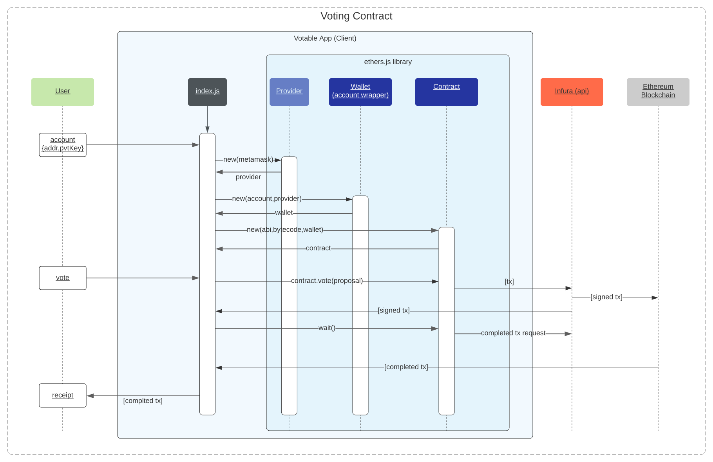
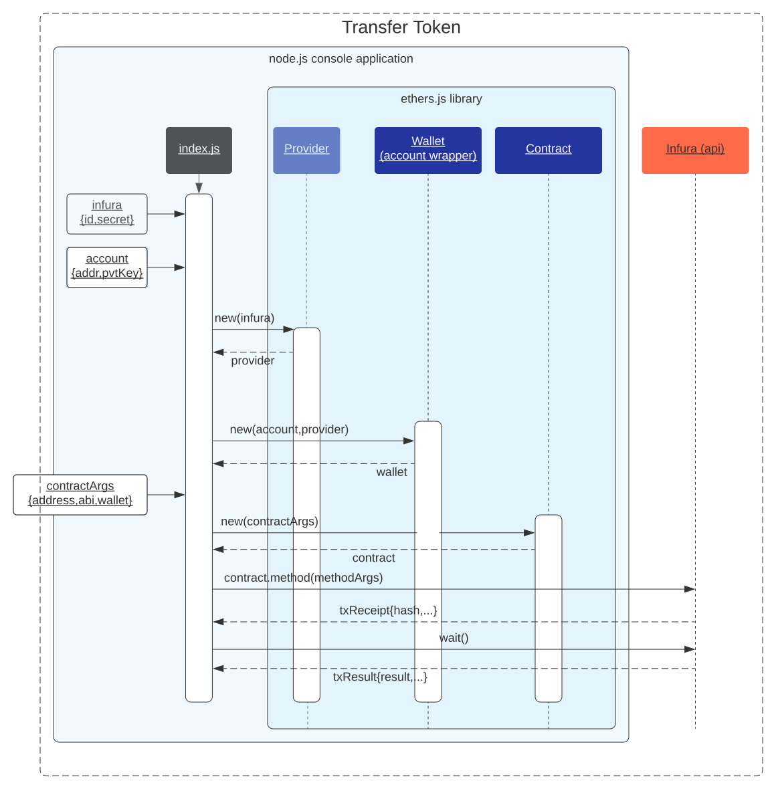

This is a tutorial on Ethers.js version 5 covering:
- Generate  new Ethereum Accounts
- Get the balance of an Ethereum Account
- Transfer Eth balance between two Ethereum Accounts
- Create a new contract using ERC20 spec (Fungible Token)
- Transfer tokens between accounts
- Create a new contract using ERC720 spec (Non Fungible Token)
- Transfer an NFT between Ethereum Accounts

A github repo is available that provides these examples as isolated modules: [https://github.com/severalpens/ethersv5](https://github.com/severalpens/ethersv5).

## Generate a new Ethereum Account

Ethers.js has a static method that creates a key pair. The generated key pair can be used as an Ethereum account:

<a href="https://github.com/severalpens/ethersv5/blob/master/t1_generateAccounts.js" target="blank">https://github.com/severalpens/ethersv5/blob/master/t1_generateAccounts.js</a>

After creating the account you can add 
test network (rinkeby) value by going to [https://faucet.rinkeby.io](https://faucet.rinkeby.io).

## Get Eth Balance
Before interacting with the Ethereum blockchain, sign up with [https://infura.io](https://infurat.io) and create a project. 

The following code gets the ETH balance for an account. Note it uses a `.env` file and the 'dotenv' npm library to store sensitive variables.

<a href="https://github.com/severalpens/ethersv5/blob/master/t2_getBalance.js" target="blank">https://github.com/severalpens/ethersv5/blob/master/t2_getBalance.js</a>

The following Sequence diagram shows how the code interacts with the blockchain

## Transfer Eth

The following demonstrates how to transfer Eth

<a href="https://github.com/severalpens/ethersv5/blob/master/t3_transferEth.js" target="blank">https://github.com/severalpens/ethersv5/blob/master/t3_transferEth.js</a>

The following Sequence diagram shows the how the code interacts with the blockchain

## Deploy Contract

To create a contract, install truffle (npm i truffle -g) and run 'truffle compile' in a terminal window.

FT:
<a href="https://github.com/severalpens/ethersv5/blob/master/tc1_createFungibleContract.js">https://github.com/severalpens/ethersv5/blob/master/tc1_createFungibleContract.js</a>

NFT:
<a href="https://github.com/severalpens/ethersv5/blob/master/tc3_createNFT.js">https://github.com/severalpens/ethersv5/blob/master/tc3_createNFT.js</a>

## Transfer Token

<a href="https://github.com/severalpens/ethersv5/blob/master/t3_transferEth.js" target="_blank">https://github.com/severalpens/ethersv5/blob/master/t3_transferEth.js</a>

The following Sequence diagram shows the how the code interacts with the blockchain

